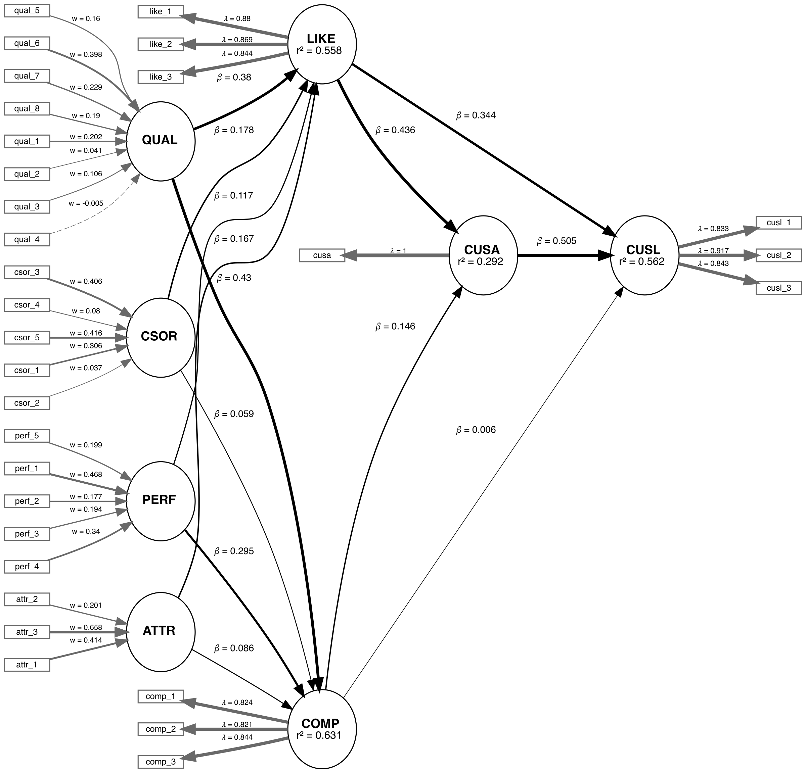
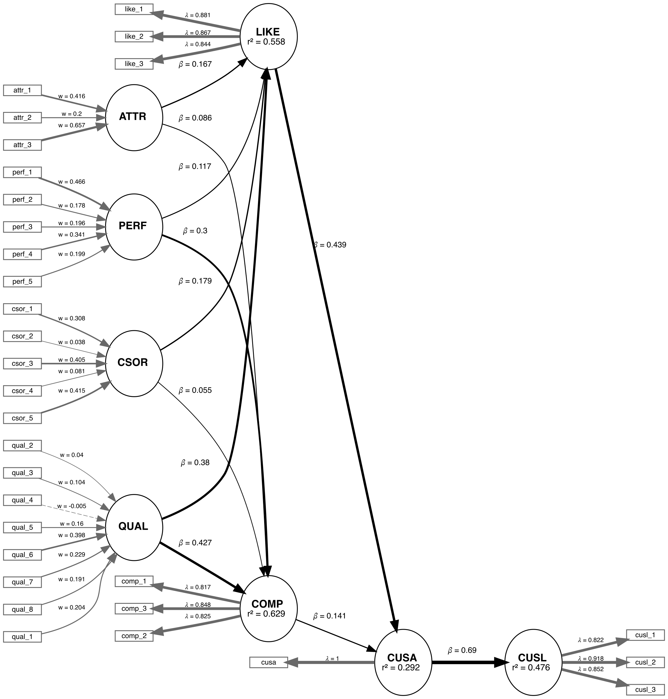

<!-- README.md is generated from README.Rmd. Please edit that file -->


<!--  -->

[](https://cran.r-project.org/package=seminrExtras)
[](https://cran.r-project.org/package=seminrExtras)

SEMinRExtras adds functionality to the SEMinR package.

SEMinR (Ray, Danks, & Calero Valdez, 2026) is a domain specific language
for modeling and estimating structural equation models. This is a
supplementary package for SEMinR and not a standalone package. This
package serves to provide additional extra methods and functions that
can be used to analyze PLS-SEM models.

SEMinRExtras provides advanced SEM tools which are compatible with
SEMinR. It implements several methods for evaluating and validating
PLS-SEM models:

- **Cross-Validated Predictive Ability Test (CVPAT)** — Compare model
  predictive performance against benchmarks or alternative models
  (Liengaard et al., 2021; Sharma et al., 2022).
- **Combined Importance-Performance Map Analysis (cIPMA)** — IPMA with
  NCA integration to identify constructs that are both important and
  necessary (Ringle & Sarstedt, 2016; Sarstedt et al., 2024; Hauff
  et al., 2024).
- **Composite Overfit Analysis (COA)** — Detect observation-level
  overfitting in PLS composite models via predictive deviance trees
  and parameter instability analysis.
- **Necessary Condition Analysis (NCA)** — Test whether predictors are
  necessary conditions for an outcome, complementing PLS-SEM's
  sufficiency logic (Dul, 2016; Richter et al., 2020).
- **NCA-ESSE** — Effect Size Sensitivity Extension that assesses how
  robust NCA results are to extreme response patterns (Becker et al.,
  2026).
- **Confirmatory Tetrad Analysis (CTA-PLS)** — Empirically test whether
  a construct's measurement model is reflective or formative, with
  indicator borrowing for constructs with fewer than 4 indicators
  (Gudergan et al., 2008).
- **Unobserved Heterogeneity** — Two complementary segmentation
  approaches for detecting latent classes in PLS-SEM:
  - **FIMIX-PLS** — EM-based probabilistic segmentation assuming
    normally distributed residuals (Hahn et al., 2002; Sarstedt et al.,
    2011).
  - **PLS-POS** — Deterministic hill-climbing segmentation that
    maximizes the sum of R-squared across segments, making no
    distributional assumptions (Becker et al., 2013).
- **Congruence Testing** — Bootstrapped congruence coefficient testing
  for construct validity (Franke, Sarstedt, & Danks, 2021).

SEMinRExtras also serves to host the example models used in the PLS-SEM
in R workbook (Hair et al., 2026).

### Functions

| Function | Description |
|---|---|
| `assess_cvpat()` | CVPAT against LM and IA benchmarks |
| `assess_cvpat_compare()` | Compare predictive loss of two PLS models |
| `assess_ipma()` | Importance-Performance Map Analysis (IPMA) |
| `assess_cipma()` | Combined IPMA with Necessary Condition Analysis (cIPMA) |
| `assess_coa()` | Composite Overfit Analysis (full pipeline) |
| `predictive_deviance()` | Compute predictive deviance scores |
| `deviance_tree()` | Identify deviant case groups via decision tree |
| `unstable_params()` | Parameter instability analysis |
| `group_rules()` | Extract decision rules for deviant groups |
| `competes()` | Show competing splits at tree nodes |
| `assess_nca()` | Necessary Condition Analysis for PLS-SEM |
| `assess_nca_esse()` | NCA with Effect Size Sensitivity Extension |
| `assess_cta()` | Confirmatory Tetrad Analysis (CTA-PLS) with indicator borrowing (Gudergan et al., 2008) |
| `assess_fimix()` | FIMIX-PLS latent class segmentation |
| `assess_fimix_compare()` | Compare FIMIX solutions across K values |
| `assess_pos()` | PLS-POS prediction-oriented segmentation (Becker et al., 2013) |
| `assess_pos_compare()` | Compare PLS-POS solutions across K values |
| `pos_segments()` | Extract segment-specific re-estimated PLS models |
| `congruence_test()` | Bootstrapped congruence coefficient testing |

## The demo files for Hair et al. (2026)

In order to access the demo files for the textbook, you can run the
`demo()` function after loading the SEMinRExtras package.

- seminr-help-debugging
- seminr-pls-cvpat
- seminr-pls-cipma
- seminr-pls-coa
- seminr-pls-nca
- seminr-pls-fimix
- seminr-pls-cta
- seminr-pls-pos
- seminr-pls-congruence
- seminr-primer-v2-chap2
- seminr-primer-v2-chap3
- seminr-primer-v2-chap4
- seminr-primer-v2-chap5
- seminr-primer-v2-chap6
- seminr-primer-v2-chap7
- seminr-primer-v2-chap8

E.g. `demo("seminr-help-debugging", package = "seminrExtras")`

## The Example model: Corporate Reputation

We are applying the CVPAT process to the corporate reputation example
bundled with SEMinR. Since we will be comparing two models, we will
first estimate and plot both models. Below you will find the competing
and established models which will be compared.

### Established Model



### Competing Model



## Example

``` r

# Create measurement model ----
corp_rep_mm_ext <- constructs(
  composite("QUAL", multi_items("qual_", 1:8), weights = mode_B),
  composite("PERF", multi_items("perf_", 1:5), weights = mode_B),
  composite("CSOR", multi_items("csor_", 1:5), weights = mode_B),
  composite("ATTR", multi_items("attr_", 1:3), weights = mode_B),
  composite("COMP", multi_items("comp_", 1:3)),
  composite("LIKE", multi_items("like_", 1:3)),
  composite("CUSA", single_item("cusa")),
  composite("CUSL", multi_items("cusl_", 1:3))
)

alt_mm <- constructs(
  composite("QUAL", multi_items("qual_", 1:8), weights = mode_B),
  composite("PERF", multi_items("perf_", 1:5), weights = mode_B),
  composite("CSOR", multi_items("csor_", 1:5), weights = mode_B),
  composite("ATTR", multi_items("attr_", 1:3), weights = mode_B),
  composite("COMP", multi_items("comp_", 1:3)),
  composite("LIKE", multi_items("like_", 1:3)),
  composite("CUSA", single_item("cusa")),
  composite("CUSL", multi_items("cusl_", 1:3))
)

# Create structural model ----
corp_rep_sm_ext <- relationships(
  paths(from = c("QUAL", "PERF", "CSOR", "ATTR"), to = c("COMP", "LIKE")),
  paths(from = c("COMP", "LIKE"), to = c("CUSA", "CUSL")),
  paths(from = c("CUSA"),         to = c("CUSL"))
)
alt_sm <- relationships(
  paths(from = c("QUAL", "PERF", "CSOR", "ATTR"), to = c("COMP", "LIKE")),
  paths(from = c("COMP", "LIKE"), to = c("CUSA")),
  paths(from = c("CUSA"),         to = c("CUSL"))
)


# Estimate the models ----
established_model <- estimate_pls(
  data = corp_rep_data,
  measurement_model = corp_rep_mm_ext,
  structural_model  = corp_rep_sm_ext,
  missing = mean_replacement,
  missing_value = "-99")

competing_model <- estimate_pls(
  data = corp_rep_data,
  measurement_model = alt_mm,
  structural_model  = alt_sm,
  missing = mean_replacement,
  missing_value = "-99")

# Function to compare the Loss of two models
compare_results <- assess_cvpat_compare(established_model = established_model,
                                        alternative_model = competing_model,
                                        testtype = "two.sided",
                                        nboot = 2000,
                                        technique = predict_DA,
                                        seed = 123,
                                        noFolds = 10,
                                        reps = 10,
                                        cores = 1)


print(compare_results,
      digits = 3)

# Assess the base model ----
assess_results <- assess_cvpat(established_model,
                               seed = 123,
                               cores = 1)
print(assess_results$CVPAT_compare_LM,
      digits = 3)
print(assess_results$CVPAT_compare_IA,
      digits = 3)
```

## First, conduct CVPAT analysis of the established model.

``` r
# Assess the base model ----
assess_results <- assess_cvpat(established_model,
                               seed = 123,
                               cores = 1)
print(assess_results$CVPAT_compare_LM,
      digits = 3)
#>         PLS Loss LM Loss   Diff Boot T value Boot P Value
#> COMP       1.196   1.211 -0.015        0.542        0.588
#> LIKE       1.915   2.063 -0.148        3.761        0.000
#> CUSA       0.994   0.983  0.011       -0.489        0.625
#> CUSL       1.560   1.600 -0.040        2.914        0.004
#> Overall    1.416   1.464 -0.048        3.482        0.001
#>
#> CVPAT as per Sharma et al. (2023).
print(assess_results$CVPAT_compare_IA,
      digits = 3)
#>         PLS Loss IA Loss   Diff Boot T value Boot P Value
#> COMP       1.196   2.023 -0.827        8.580        0.000
#> LIKE       1.915   3.103 -1.187        8.293        0.000
#> CUSA       0.994   1.374 -0.379        5.004        0.000
#> CUSL       1.560   2.663 -1.102        7.572        0.000
#> Overall    1.416   2.290 -0.874       10.301        0.000
#>
#> CVPAT as per Sharma et al. (2023).
```

The established model has significantly lower predictive loss compared
to both the naive benchmark IA and the LM model. Thus, we can say that
the established model has predictive relevance.

Now we compare the results:

``` r
# Function to compare the Loss of two models
compare_results <- assess_cvpat_compare(established_model = established_model,
                                        alternative_model = competing_model,
                                        testtype = "two.sided",
                                        nboot = 2000,
                                        technique = predict_DA,
                                        seed = 123,
                                        noFolds = 10,
                                        reps = 10,
                                        cores = 1)

print(compare_results,
      digits = 3)
#>         Base Model Loss Alt Model Loss   Diff Boot T value Boot P Value
#> COMP              1.198          1.195  0.003       -0.460        0.645
#> LIKE              1.923          1.933 -0.010        0.883        0.378
#> CUSA              0.988          0.992 -0.004        0.809        0.419
#> CUSL              1.562          1.715 -0.152        3.286        0.001
#> Overall           1.418          1.459 -0.041        3.293        0.001
#>
#> CVPAT as per Sharma, Liengaard, Hair, Sarstedt, & Ringle, (2023).
#>   Both models under comparison have identical endogenous constructs with identical measurement models.
#>   Purely exogenous constructs can differ in regards to their relationships with both nomological
#>   partners and measurement indicators.
```

The established model has significantly lower predictive loss compared
to the competing model. Thus, we can say that the established model has
superior predictive performance compared to the competing model.

## Confirmatory Tetrad Analysis (CTA-PLS)

CTA-PLS (Gudergan et al., 2008) empirically tests whether a
construct's measurement model is consistent with a reflective (common
factor) specification. Under a reflective model, all model-implied
vanishing tetrads equal zero. If any tetrad is significantly non-zero,
the reflective specification is rejected in favour of a formative one.

CTA-PLS requires at least 4 indicators per construct. When `borrow =
TRUE` (the default), constructs with only 2 or 3 indicators can still
be tested by borrowing indicators from structurally connected
constructs. The borrowing rules follow Gudergan et al. (2008, Table 1):
a reflective construct with 3 own indicators borrows 1 from an adjacent
reflective construct (all tetrads vanish under H0), while a construct
with 2 own indicators borrows 2 from any adjacent construct (only the
cross-tetrad tau\_1342 vanishes).

``` r
library(seminr)
library(seminrExtras)

mobi_mm <- constructs(
  composite("Image",        multi_items("IMAG", 1:5)),
  composite("Expectation",  multi_items("CUEX", 1:3)),
  composite("Value",        multi_items("PERV", 1:2)),
  composite("Satisfaction", multi_items("CUSA", 1:3)),
  composite("Loyalty",      multi_items("CUSL", 1:3))
)

mobi_sm <- relationships(
  paths(from = "Image",       to = c("Expectation", "Satisfaction", "Loyalty")),
  paths(from = "Expectation", to = c("Value", "Satisfaction")),
  paths(from = "Value",       to = "Satisfaction"),
  paths(from = "Satisfaction", to = "Loyalty")
)

mobi_pls <- estimate_pls(data = mobi,
                          measurement_model = mobi_mm,
                          structural_model  = mobi_sm)

# CTA-PLS with borrowing (default) — constructs with 2-3 indicators
# borrow from adjacent constructs to form testable 4-tuples
cta_result <- assess_cta(mobi_pls, nboot = 5000, seed = 123)
print(cta_result)
summary(cta_result)

# Without borrowing — only constructs with >= 4 indicators are tested
cta_no_borrow <- assess_cta(mobi_pls, nboot = 5000, borrow = FALSE)
print(cta_no_borrow)
```

## Unobserved Heterogeneity (FIMIX-PLS and PLS-POS)

FIMIX-PLS and PLS-POS are complementary approaches for detecting
unobserved heterogeneity in PLS-SEM. FIMIX-PLS uses probabilistic
(EM-based) assignment and assumes normally distributed residuals,
while PLS-POS uses deterministic (hill-climbing) assignment with no
distributional assumptions. Both methods partition the sample into K
segments with segment-specific path coefficients.

### FIMIX-PLS (Finite Mixture PLS)

FIMIX-PLS (Hahn et al., 2002; Sarstedt et al., 2011) probabilistically
assigns observations to K segments, each with segment-specific structural
path coefficients.

`assess_fimix()` estimates a single K-segment solution, while
`assess_fimix_compare()` compares solutions across K values using
information criteria (AIC, BIC, CAIC, etc.) to help select the
optimal number of segments.

``` r
library(seminr)
library(seminrExtras)

# Estimate a PLS model
corp_pls <- estimate_pls(
  data = corp_rep_data,
  measurement_model = corp_rep_mm_ext,
  structural_model  = corp_rep_sm_ext,
  missing = mean_replacement,
  missing_value = "-99")

# FIMIX with K=2 segments
fimix_k2 <- assess_fimix(corp_pls, K = 2, nstart = 10, seed = 123)
print(fimix_k2)
summary(fimix_k2)
plot(fimix_k2)

# Compare across K=2..4 using information criteria
fimix_compare <- assess_fimix_compare(corp_pls,
                                       K_range = 2:4,
                                       nstart = 10,
                                       seed = 123)
print(fimix_compare)
plot(fimix_compare)
```

### PLS-POS (Prediction-Oriented Segmentation)

PLS-POS (Becker et al., 2013) maximizes the sum of R-squared across
all endogenous constructs across K segments using deterministic
hill-climbing. Unlike FIMIX-PLS, it makes no distributional
assumptions and can detect heterogeneity in both structural and
formative measurement models.

`assess_pos()` estimates a single K-segment solution, while
`assess_pos_compare()` compares solutions across multiple K values
using the objective criterion (sum of R-squared).

``` r
# PLS-POS with K=2 segments (using corp_pls from above)
pos_k2 <- assess_pos(corp_pls, K = 2, nstart = 10, seed = 123)
print(pos_k2)
summary(pos_k2)
plot(pos_k2, type = "rsquared")

# Compare across K=2..4
pos_compare <- assess_pos_compare(corp_pls,
                                   K_range = 2:4,
                                   nstart = 10,
                                   seed = 123)
print(pos_compare)
plot(pos_compare)
```

## Congruence Testing

Congruence testing (Franke, Sarstedt, & Danks, 2021) evaluates
whether PLS composite weights are stable across bootstrap samples by
computing congruence coefficients. A congruence coefficient close to
1 indicates that the composite weight pattern is robust.

``` r
cong_result <- congruence_test(mobi_pls,
                                nboot = 2000,
                                seed = 123)
print(cong_result)
summary(cong_result)
```

# References

- Becker, J.-M., Rai, A., Ringle, C. M., & Voelckner, F. (2013).
  Discovering Unobserved Heterogeneity in Structural Equation Models to
  Avert Validity Threats. MIS Quarterly, 37(3), 665-694.
- Becker, J.-M., Richter, N. F., Ringle, C. M., & Sarstedt, M. (2026).
  Must-have, or maybe not? A sensitivity-based extension to necessary
  condition analysis. Journal of Business Research, 206, 115920.
- Dul, J. (2016). Necessary Condition Analysis (NCA): Logic and
  methodology of "necessary but not sufficient" causality.
  Organizational Research Methods, 19(1), 10-52.
- Franke, G. R., Sarstedt, M., & Danks, N. P. (2021). An empirical
  comparison of factor score estimation methods. Journal of Business
  Research, 130, 318-334.
- Hahn, C., Johnson, M. D., Herrmann, A., & Huber, F. (2002). Capturing
  Customer Heterogeneity using a Finite Mixture PLS Approach.
  Schmalenbach Business Review, 54, 243-269.
- Gudergan, S. P., Ringle, C. M., Wende, S. & Will, A. (2008).
  Confirmatory Tetrad Analysis in PLS Path Modeling. Journal of Business
  Research, 61(12), 1238-1249.
- Hair, J.F. (Jr), Hult, T.M., Ringle, C.M., Sarstedt, M., Danks, N.P.,
  and Adler, S. (2026). Partial Least Squares Structural Equation
  Modeling (PLS-SEM) Using R (Second Edition) - A Workbook. Springer.
- Hauff, S., Richter, N. F., Sarstedt, M., & Ringle, C. M. (2024).
  Importance and Performance in PLS-SEM and NCA: Introducing the
  Combined Importance-Performance Map Analysis (cIPMA). Journal of
  Retailing and Consumer Services, 78, 103723.
- Liengaard, B. D., Sharma, P. N., Hult, G. T. M., Jensen, M. B.,
  Sarstedt, M., Hair, J. F., & Ringle, C. M. (2021). Prediction:
  coveted, yet forsaken? Introducing a cross-validated predictive ability
  test in partial least squares path modeling. Decision Sciences, 52(2),
  362-392.
- Ray, S., Danks, N.P., Calero Valdez, A. (2026) SEMinR: Domain-specific
  language for building, estimating, and visualizing structural equation
  models in R.
- Richter, N. F., Schubring, S., Hauff, S., Ringle, C. M., &
  Sarstedt, M. (2020). When predictors of outcomes are necessary:
  guidelines for the combined use of PLS-SEM and NCA. Industrial
  Management & Data Systems, 120(12), 2243-2267.
- Sarstedt, M., Becker, J.-M., Ringle, C. M. & Schwaiger, M. (2011).
  Uncovering and Treating Unobserved Heterogeneity with FIMIX-PLS.
  Schmalenbach Business Review, 63(1), 34-62.
- Ringle, C. M. & Sarstedt, M. (2016). Gain More Insight from Your
  PLS-SEM Results: The Importance-Performance Map Analysis. Industrial
  Management & Data Systems, 119(9), 1865-1886.
- Sarstedt, M., Richter, N. F., Hauff, S. & Ringle, C. M. (2024).
  Combined Importance-Performance Map Analysis (cIPMA): A SmartPLS 4
  Tutorial. Journal of Marketing Analytics, 12, 746-760.
- Sharma, P. N., Liengaard, B. D., Hair, J. F., Sarstedt, M., &
  Ringle, C. M. (2022). Predictive model assessment and selection in
  composite-based modeling using PLS-SEM: extensions and guidelines for
  using CVPAT. European Journal of Marketing, 57(6), 1662-1677.
